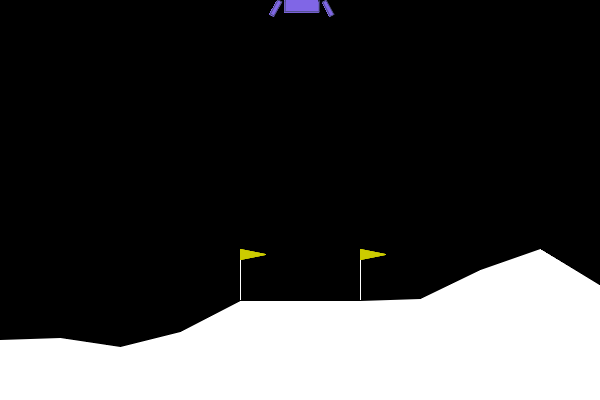

# SAC Discrete Version Design Document

## Project Overview

This project implements the SAC (Soft Actor-Critic) algorithm adapted for discrete action spaces, with complete training, evaluation, and visualization capabilities.

## File Structure

### 1. `config.py`
- **Purpose**: Centralized hyperparameter configuration management
- **Key Configurations**:
  - Environment settings: `env_id`, `seed`, `device`
  - Network architecture: `net_hidden_sizes`
  - Algorithm parameters: learning rates, discount factor, alpha, tau
  - Training settings: total steps, batch size, evaluation intervals
  - Gradient clipping: `max_grad_norm`

### 2. `network.py`
Contains all neural network modules:

#### `Actor` - Policy Network
- **Purpose**: Outputs probability distribution over discrete actions
- **Methods**:
  - `forward(state)` → logits
  - `get_probs(state)` → probability distribution
  - `sample(state, deterministic)` → (action, log_prob)
  - `act(state, eval_mode)` → action

#### `QCritic` - Action-Value Network
- **Purpose**: Estimates Q-values for all discrete actions
- **Methods**:
  - `forward(state)` → Q(s, ·)
  - `q_of_action(state, action)` → Q(s,a)
  - `greedy_action(state)` → greedy action

#### `VCritic` - State-Value Network
- **Purpose**: Estimates state value V(s)
- **Methods**:
  - `forward(state)` → V(s)
  - `value(state)` → V(s)

### 3. `replay_buffer.py`
Contains experience replay and data collection:

#### `ReplayBuffer`
- **Purpose**: Ring buffer for storing experiences
- **Methods**:
  - `store(state, action, reward, next_state, done)`
  - `sample_batch(batch_size)` → batch data

#### `RolloutCollector`
- **Purpose**: Interact with environment and collect experience data
- **Features**:
  - Supports random, stochastic policy, and greedy modes
  - Separate handling of termination/truncation
  - Automatic environment reset and statistics tracking
- **Methods**:
  - `collect(n_steps, mode)` → interaction logs
  - `select_action(state, mode)` → action selection

### 4. `algorithm.py`
Core algorithm implementation:

#### `SACDiscreteVAlgorithm`
- **Components**:
  - Actor network
  - Twin Q networks (Q0, Q1)
  - V network + target V network
  - Independent optimizers
- **Key Update Methods**:
  - `_update_q()` - Q network updates (using Huber loss)
  - `_update_v()` - V network update (soft value function)
  - `_update_actor()` - Policy update (using min(Q0,Q1))
  - `_soft_update()` - Target network soft update
- **Features**:
  - Gradient clipping (all networks)
  - Independent Q network updates (avoid gradient mixing)
  - Comprehensive training logs

### 5. `train.py`
Main training program:

- **Functions**:
  - Environment dimension inference
  - Component building and initialization
  - Complete training loop
  - Periodic evaluation and logging
  - GIF demo saving after training completion
- **Key Functions**:
  - `infer_env_dims()` - Automatic environment dimension inference
  - `evaluate()` - Policy evaluation
  - `build_components()` - Component construction
  - `train_loop()` - Main training loop
  - `save_policy_gif()` - Visualization saving

## Algorithm Features

### SAC Discrete Version Implementation
1. **Soft Policy Iteration**: Combines policy gradient and value function learning
2. **Twin Q Networks**: Reduces Q-value overestimation
3. **Soft State Value**: V(s) = E[min(Q0,Q1) - α log π]
4. **Entropy Regularization**: Balances exploration and exploitation

### Key Improvements
1. **Termination/Truncation Separation**:
   - Training done: `float(terminated)`
   - Environment reset: `terminated or truncated`

2. **Gradient Stability**:
   - Huber loss instead of MSE
   - Gradient clipping for all networks
   - Independent Q network updates

3. **Actor Target Correction**:
   - Uses `min(Q0, Q1)` instead of single Q network
   - Aligns with SAC theoretical requirements

## Configuration Example

```python
cfg = SACConfig(
    env_id="LunarLander-v3",
    device="cuda",
    seed=0,
    
    # Network configuration
    net_hidden_sizes=(128, 128),
    
    # Algorithm parameters
    algo_lr_actor=3e-4,
    algo_lr_critic=3e-4,
    algo_alpha=0.1,
    algo_gamma=0.99,
    algo_tau=0.005,
    max_grad_norm=10.0,
    
    # Training configuration
    train_total_steps=1_000_000,
    buffer_batch_size=512,
    collector_warmup_steps=5_000,
    train_eval_every=5_000
)
```

## Usage

```bash
cd /root/younger-rl/sac
python train.py
```

After training completion, generates:
- Training logs (including losses, returns, entropy values, etc.)
- GIF animation demonstrating trained policy performance

## Demo

### Trained SAC Policy on LunarLander-v3



*The above GIF shows the trained SAC agent successfully landing the lunar lander after training completion.*

## Design Advantages

1. **Modular Design**: Clear component responsibilities, easy to maintain and extend
2. **Centralized Configuration**: Unified hyperparameter management
3. **Type Safety**: Complete type annotations
4. **Algorithm Correctness**: Strict implementation following SAC theory
5. **Engineering Practices**: Includes gradient clipping, loss function selection, evaluation mechanisms, etc.

This design ensures both theoretical correctness and good engineering practices, suitable for both research and practical applications.